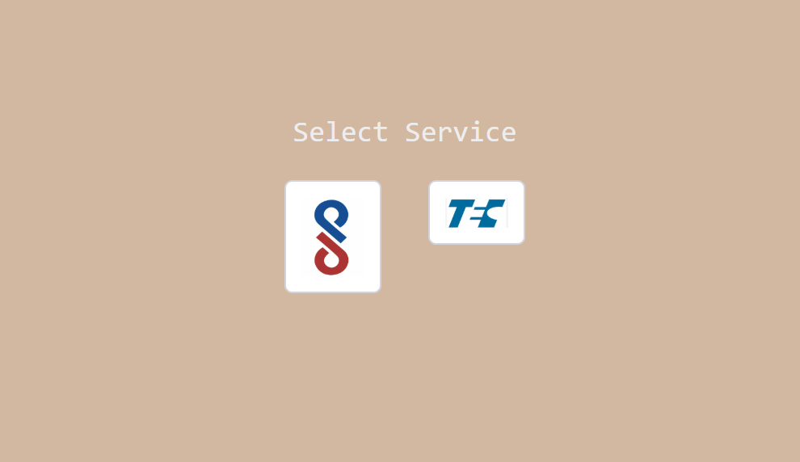

Docs Automation Portal (ISI / BIS)

Docs Automation Portal is a web application designed to simplify and automate the generation of ISI and BIS-related documents. Instead of manually identifying required forms and preparing multiple documents separately, users can select the appropriate license through a guided decision tree, fill out a single form, and download all required documents together as a ZIP file.

This project focuses on reducing repetitive work, minimizing errors, and making complex documentation workflows easier to manage.

Live Demo
🔗 Live Application:
https://vincular-app.vercel.app/

Features
Guided license and service selection using an intuitive decision tree
Dynamic form generation based on the selected license or service
Automated DOCX document creation using predefined templates
One-click ZIP download containing all required documents
Clean, responsive, and user-friendly interface built with Tailwind CSS

Tech Stack
⚛️ React 18
⏭️ Next.js 14
🎨 Tailwind CSS
📄 docx
🧩 docxtemplater
🗜️ PizZip
📦 JSZip
💾 File Saver

How It Works
Select the required ISI or BIS service from the decision tree
Fill in the dynamically generated form fields
Click the download button
All relevant documents are generated and downloaded as a single ZIP file.

Screenshots
Service Selection

Add screenshot here

License Decision Tree

Add screenshot here

Form Input

Add screenshot here

Installation & Setup
git clone <repository-url>
cd docs-automation-portal
npm install
npm run dev

The application will be available at:
http://localhost:3000

Project Highlights
Eliminates repetitive manual documentation tasks
Ensures consistency and accuracy across generated documents
Easily extendable to support new licenses and document types
Scales well as documentation requirements grow
